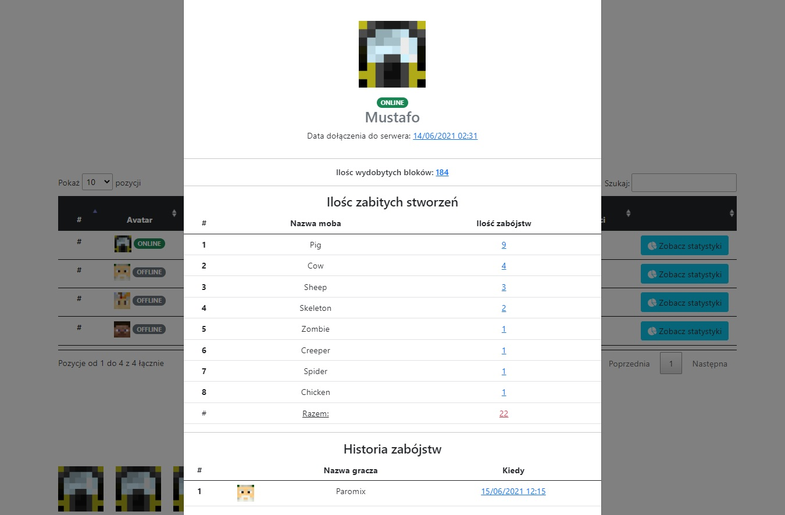

[](https://github.com/zyeloni/ti-projekt/actions/workflows/main.yml)

# RANKED.IO-APP

Celem programu jest utworzenie rozwiązania chmurowego odpowiedzialnego za gromadzenie danych z serwera do gry minecraft. Dane przechowywane będa w bazie postgresql.
Całość projektu będzie rozłożona ma mikroserwisy.

## Specyfikacja mikroserwisów

## Komunikacja


Serwer gry (minecraft) komunikuję się z klientem (grą) poprzez porty **TCP/UDP** na porcie **25565**.
Serwer frontendowy, backendowy komunikują się poprzez protokół **HTTP** po przez serwis **REST**.

## Instalacja

Ranked.io wymaga **[DOCKER'a](https://www.docker.com/)**.

```sh
docker-compose up
```
To wszystko docker zrobi za Ciebie resztę

## Autorzy

| Lp | Imię i Nazwisko |
| ------ | ------ |
| 1. | Kacper Łukasik |
| 2. | Michał Mulik |
| 3. | Sebastian Komuda |

## Wykorzystane technologię

- js (vue.js)
- java
- python (django)
- postgresql

## Wykorzystane obrazy

Lista wykorzystanych obrazów z DOCKER HUB

- nginx
- itzg/minecraft-server
- postgres
- python

## Struktura folderów

| FOLDER | OPIS |
| ------ | ------ |
| /backend | folder z aplikacją backendową |
| /frontend | folder z aplikacją frontendową |
| /minecraft-server | folder z serwerem do gry minecraft |
| /data | folder danych bazy sql |
| /ranked-io-plugin | folder z kodem źródłowym pluginu do serwera minecraft |


## Zrzuty z aplikacji frontendowej





## Licencja

MIT
