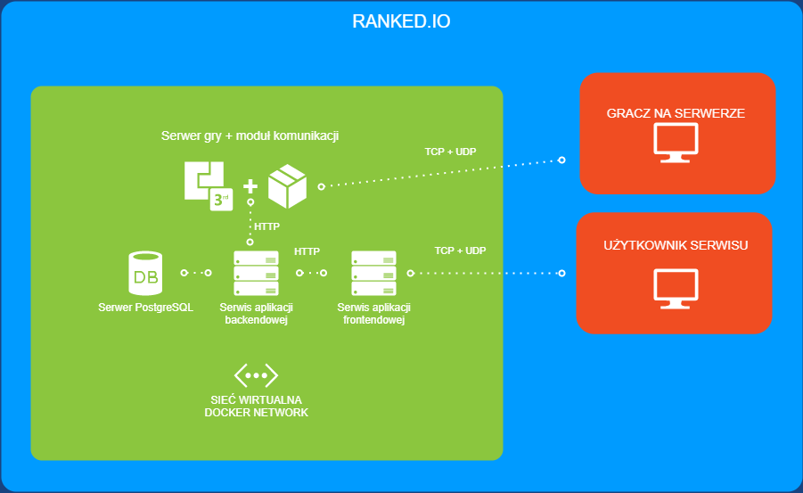
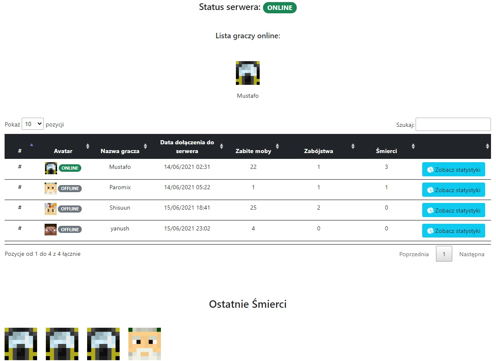
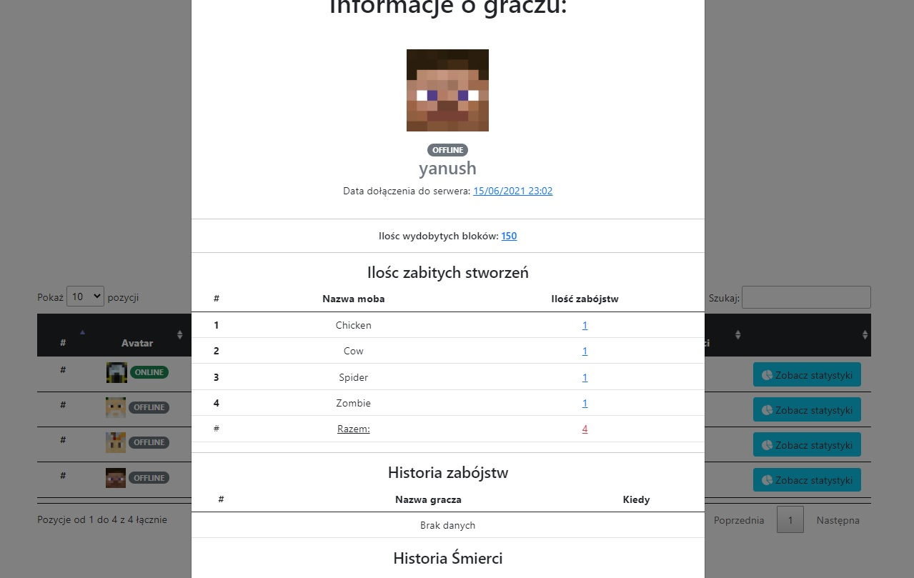

# RANKED.IO-APP

## Autorzy

| Lp | Imię i Nazwisko |
| ------ | ------ |
| 1. | Kacper Łukasik |
| 2. | Michał Mulik |
| 3. | Sebastian Komuda |

## Cel projektów

Celem programu jest utworzenie rozwiązania chmurowego odpowiedzialnego za gromadzenie danych z serwera do gry minecraft. Dane przechowywane będa w bazie postgresql.
Całość projektu będzie rozłożona ma mikroserwisy.

## Specyfikacja mikroserwisów

#### Domyślne hosty oraz porty kontenerów

- frontend **( frontend:8081 )**
- backend **( backend:1337 )**
- postgres **( postgres:5432 )**
- minecraft **( minecraft:25565 oraz minecraft:4567 )**

## Komunikacja



Serwer gry (minecraft) komunikuję się z klientem (grą) poprzez porty **TCP/UDP** na porcie **25565**.
Serwer frontendowy, backendowy komunikują się poprzez protokół **HTTP** po przez serwis **REST**.

#### Specyfikacja API - BACKEND

API dostępne pod adressem http://backend:1337

```bash
# zwraca listę wszystkich graczy, którzy przynajmniej raz się zalogowali na serwer
curl -X GET /players
# odpowiedź
[
    {
        "id": 7,
        "uuid": "b53006c8-2b25-4d21-8432-c8695412317c",
        "displayName": "Mustafo",
        "createdAt": "2021-06-14T00:31:46.317994Z"
    },
    {
        "id": 41,
        "uuid": "7ed4ff84-1694-42d6-9b99-3530d207ccbc",
        "displayName": "Shisuun",
        "createdAt": "2021-06-15T16:41:09.189231Z"
    },
]

```

```bash
# dodaje gracza do bazy graczy
curl -X POST \
    --data '{"uuid": "uuid_gracza", "displayName": "nazwa gracza"}' \
    /players
# odpowiedź
{
	"uuid": "asdasdasdasdasdasdasd",
	"displayName": "alamakota"
}
```

```bash
# wyświetla statystki zabitych mobów dla podanego gracza 
curl -X GET /entitystats/<id_gracza>
# odpowiedź
[
    {
        "player": 7,
        "entityType": "Sheep",
        "total": 11
    },
    {
        "player": 7,
        "entityType": "Pig",
        "total": 9
    },
    {
        "player": 7,
        "entityType": "Cow",
        "total": 4
    },
]
```

```bash
# dodaje zabitego moba dla gracza
curl -X POST \
    --data '{"player": "uuid_gracza", "entityType": "entity_type"}' \
    /entitystats/<id_gracza>
# odpowiedź
[
    {
        "player": 7,
        "entityType": "Sheep",
    },
]
```

```bash
# zwraca statysytki wydobytych bloków dla podanego gracza
curl -X GET /blockstats/<uuid_gracza>
# odpowiedź
[
    {
        "player": 7,
        "total": 202
    }
]
```

```bash
# dodaje zabitego moba dla gracza
curl -X POST \
    --data '{"player": "uuid_gracza", "blockType": "block_type"}' \
    /blockstats/<id_gracza>
# odpowiedź
[
    {
        "player": 7,
        "blockType": "Stone",
    },
]
```

```bash
# wyświetla informacje o zabójcy/ofierze
curl -X GET /kills/<type:vitim|killer>/<uuid_gracza>
# odpowiedz
[
    {
        "killer": {
            "id": 7,
            "uuid": "b53006c8-2b25-4d21-8432-c8695412317c",
            "displayName": "Mustafo",
            "createdAt": "2021-06-14T00:31:46.317994Z"
        },
        "victim": {
            "id": 40,
            "uuid": "853c80ef3c3749fdaa49938b674adae6",
            "displayName": "Paromix",
            "createdAt": "2021-06-14T03:22:32.692442Z"
        },
        "createdAt": "2021-06-15T10:15:25.798740Z"
    }
]
```

```bash
# dodaje do bazy danych historię zabójstwa
curl -X POST \
    --data '{"killer": <uuid_gracza>, "victim": <id_gracza>}' \
    /kills/add
# odpowiedź
[
    {
        "killer": {
            "id": 7,
            "uuid": "b53006c8-2b25-4d21-8432-c8695412317c",
            "displayName": "Mustafo",
            "createdAt": "2021-06-14T00:31:46.317994Z"
        },
        "victim": {
            "id": 40,
            "uuid": "853c80ef3c3749fdaa49938b674adae6",
            "displayName": "Paromix",
            "createdAt": "2021-06-14T03:22:32.692442Z"
        },
        "createdAt": "2021-06-15T10:15:25.798740Z"
    }
]
```

```bash
# zwraca cała historię zabójstw
curl -X GET /kills
# odpowiedź 
[
    {
        "killer": 7,
        "victim": 40
    },
    {
        "killer": 40,
        "victim": 7
    },
    {
        "killer": 41,
        "victim": 7
    },
    {
        "killer": 41,
        "victim": 7
    }
]
```

```bash
# zwraca ostatnie 10 zabójstw
curl -X GET /lastkills
# odpowiedź 
[
    {
        "killer": {
            "id": 41,
            "uuid": "7ed4ff84-1694-42d6-9b99-3530d207ccbc",
            "displayName": "Shisuun",
            "createdAt": "2021-06-15T16:41:09.189231Z"
        },
        "victim": {
            "id": 7,
            "uuid": "b53006c8-2b25-4d21-8432-c8695412317c",
            "displayName": "Mustafo",
            "createdAt": "2021-06-14T00:31:46.317994Z"
        },
        "createdAt": "2021-06-15T17:19:07.198219Z"
    }
]
```

```bash
# zwraca wszystkie statystki dla wszystkich graczy
curl -X GET /stats
# odpowiedz
[
    {
        "player": 44,
        "total": 4
    },
    {
        "player": 40,
        "total": 1
    },
    {
        "player": 41,
        "total": 25
    },
    {
        "player": 7,
        "total": 33
    }
]
```

## Instalacja

Ranked.io wymaga **[DOCKER'a](https://www.docker.com/)**.

```sh
docker-compose up
```
To wszystko docker zrobi za Ciebie resztę

## Wykorzystane technologię

- js (vue.js)
- java
- python (django)
- postgresql

## Wykorzystane obrazy

Lista wykorzystanych obrazów z DOCKER HUB

- nginx
- itzg/minecraft-server
- postgres
- python

## Struktura folderów

| FOLDER | OPIS |
| ------ | ------ |
| /backend | folder z aplikacją backendową |
| /frontend | folder z aplikacją frontendową |
| /minecraft-server | folder z serwerem do gry minecraft |
| /data | folder danych bazy sql |
| /ranked-io-plugin | folder z kodem źródłowym pluginu do serwera minecraft |


## Zrzuty z aplikacji frontendowej



